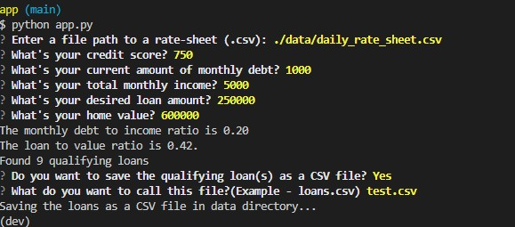

# Loan Qualifier App

This application is a Loan Qualifier. It helps you use an applicants information, and then filters through a list of lenders and their requirements to match up applicants with lenders.

The information required to use the App will be - Rate sheet with list of lenders and requirements, Credit score for applicant, monthly debt payments for applicant, monthly income for applicant, the total loan amount they are seeking, and the estimated value of the home. 

This app saves the user alot of time by not having to manually filter through a list of lenders to find a sutiable match. Its flexible and can accept varying inputs for multiple applicants.

---

## Technologies

To use this application you will need the following:

- Python 3.7
- Latest `fire` library
- latest `questionary` library
- [Anaconda]( https://docs.anaconda.com/anaconda/install/)  or mini conda to create a dev environment
- A CLI tool or IDE(Integrated Developer Environment) to interact with the program

For the examples i will be using vs code to run the qualifier within my `dev` environment
    

---

## Installation Guide

To install the above libraries go ahead and type this into your desired dev environment:

- Creating a dev environment for python 3.7 called 'dev' - if you do not already have an environment setup 
    - `conda create -n dev python=3.7 anaconda`
    - Once you have created the environment type the following to activate and deactivate.
    

- fire library
    - `pip install fire` 
- questionary library
    - `pip install questionary` 

Make sure you install the fire and questionary modules inside your `dev` env and have it active when using the app or you will get errors. 

---

## Usage

Once you have the environment setup and you've cloned the repo go ahead and navigate to your desired ide and locate the file. I will be using VS code for my examples. 

1. start by navigating to the same directory as the app.py file 

2. Activate your dev environment. 

`conda activate dev`

3. test out the application with what ever parameters you want! if you have an updated daily_rate_sheet.csv, best update that file first. Otherwise use whats still there and see what loans you qualify for!

4. When finished running potential loans, dont forget to deactivate your dev env to make sure you dont get any problems. ` conda deactivate` 

---

## Contributors

[Robin Thorsen](https://www.linkedin.com/in/robin-thorsen-079819120/) was the main developer working on this project. Alot of code was provided by UC Berkeley for this challenge. 

Best reached via email - robinbthorsen@gmail.com

---

## License

Apache 2.0 public License applied, feel free to clone and fork and use and reach out if you have questions. 
